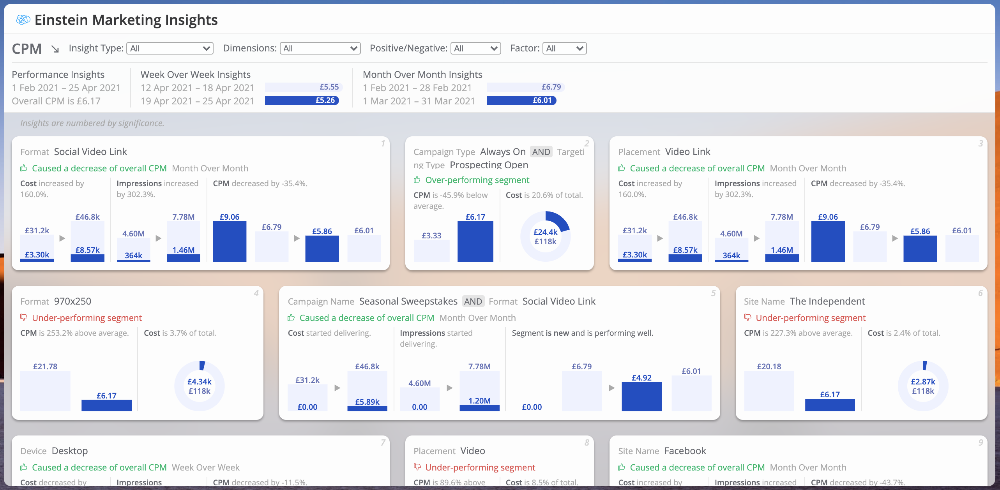

# datorama-d3-einstein-explorer
Custom widget for Datorama. Visualises insights from Einstein Marketing Insights bots in the workspace.

This custom widget loads bots in the workspace and visualises their insights. It can either be used as an open 'explorer', or limited to a single bot.



## Style and Script Dependencies
Add `emiExplorer.initialize();` to the JS section of the Custom Widget Editor, and add the below links to the dependencies area (second button at the top left of the Custom Widget Editor).

Script dependencies (must be loaded in this order):
1. `https://d3js.org/d3.v5.min.js`
2. `https://dato-custom-widgets-js-css.s3.eu-west-2.amazonaws.com/einstein-explorer/Einstein+Explorer.js`

Style depenency:
1. `https://dato-custom-widgets-js-css.s3.eu-west-2.amazonaws.com/einstein-explorer/Einstein+Explorer.css`

## Preferences
All configuration options are located in the widget's design panel.

These include options for
* which view to initially load;
* bot restrictions;
* bot locking;
* visualisation colours;
* name replacement;
* locale settings; and
* metric formatting.

## Recommended Configuration
### Style
* **Remove widget background fill colour:** Scroll right to the bottom of the widget design panel, open the background group, tick the fill colour box, and change opacity to 0. The minimum value of the normal opacity setting is 1, so it's undesirable for this purpose.
* **Remove widget paddings:** Scroll right to the bottom of the widget design panel, tick the paddings box, open the background group, tick the paddings box, and set all values to zero. The construction of the widget means it creates its own boundaries, so this lets it fill the usual widget space.
* **Add a background image:** If you don't have a page background image, you can add one directly to the widget to take advantage of the content view's background gaussian blur for a nice effect. Scroll right to the bottom of the widget design panel, open the background group, tick the background image box, and either upload an image or use one from Unsplash. If you add a background image directly to the widget, you'll also need to
  * Add a 10px corner radius to the widget, again in the background design options.
  * Add this to the Advanced Custom CSS of the widget, so that the content truly reaches the edges:
```css
.widget-wrapper {
  padding-left: 0 !important;
  padding-right: 0 !important;
  padding-bottom: 0 !important;
}

.widget-container {
  border: none;
}
```

### Performance
To eliminate usage of the value format API and greatly improve performance, set your locale and choose pre-defined measurement formats from the widget design panel for all measurements.
